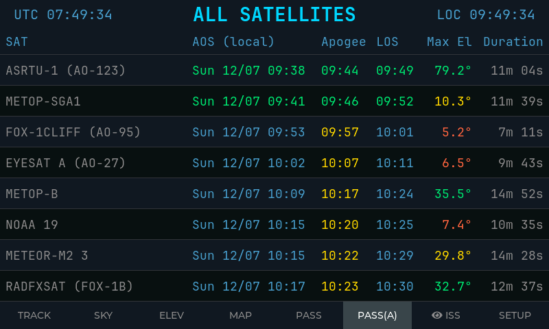
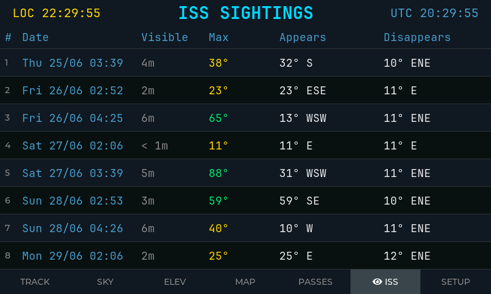
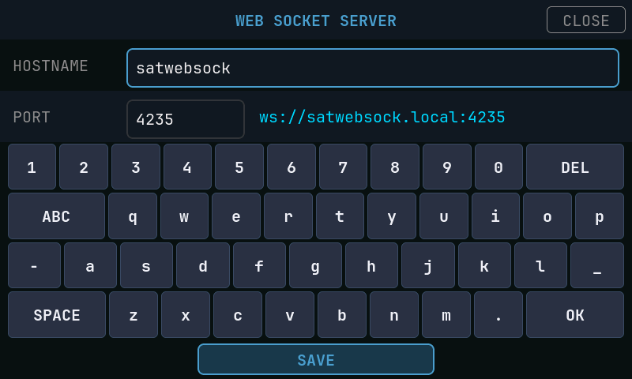
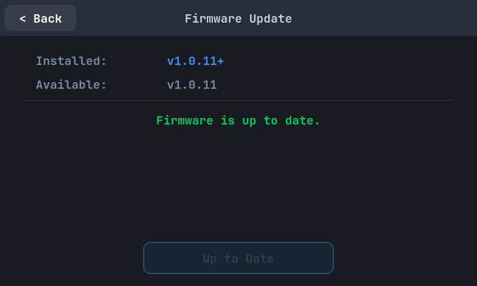
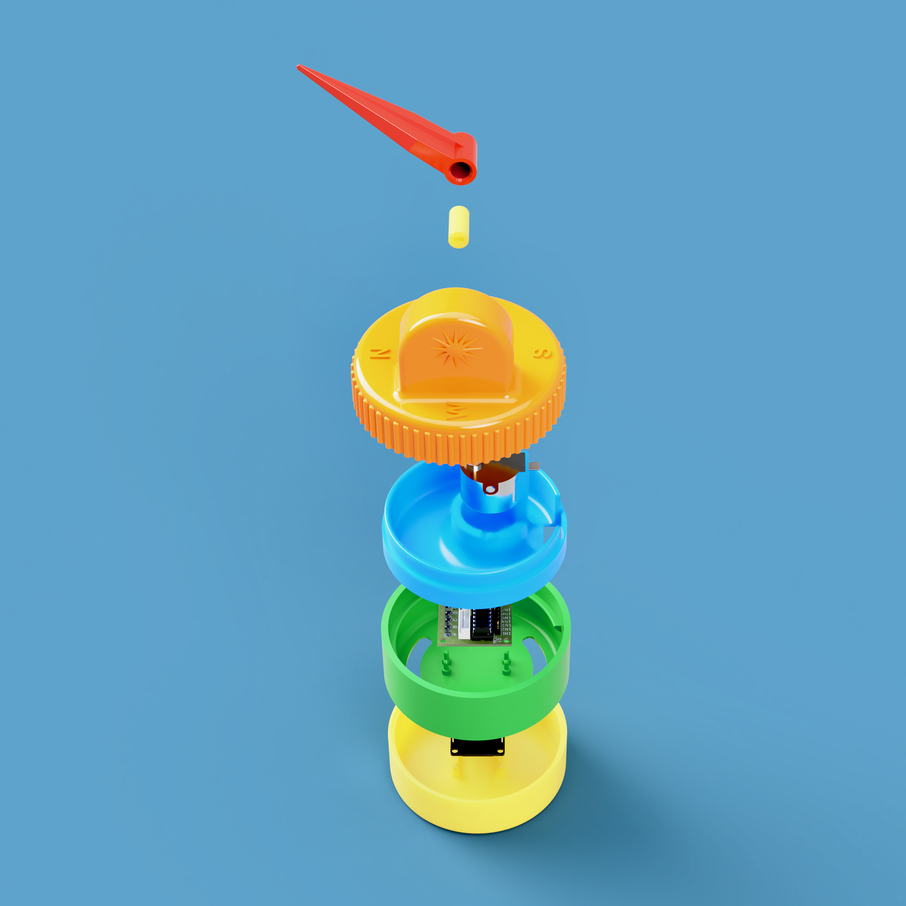
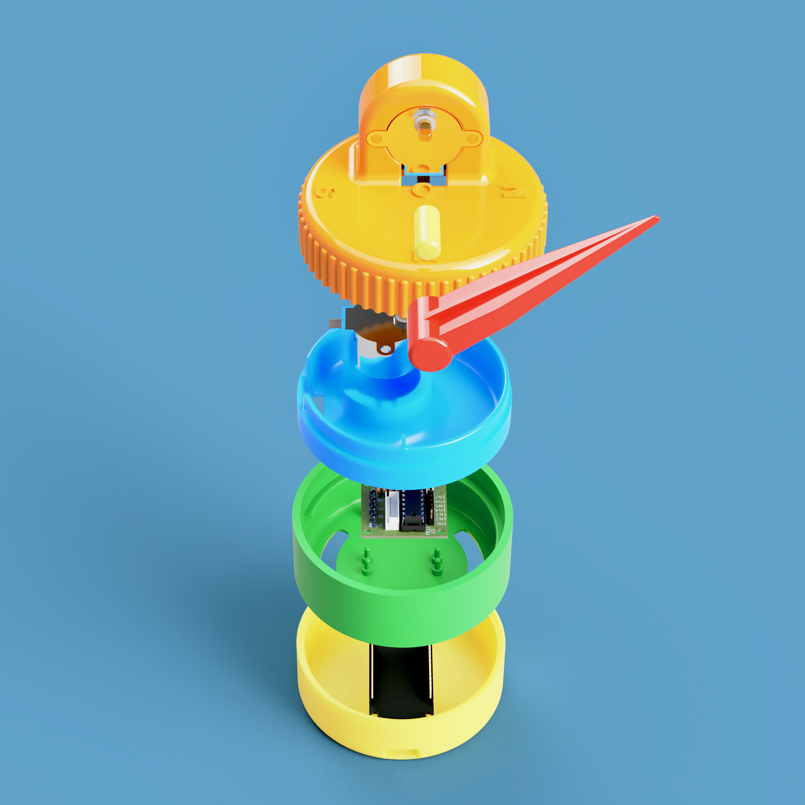
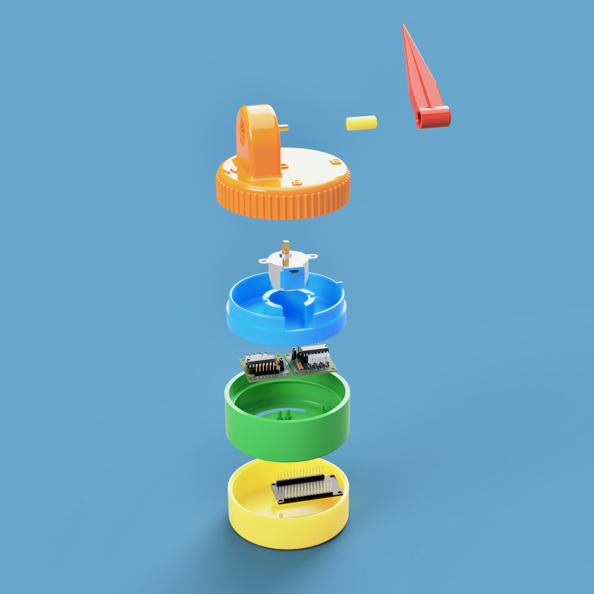

# ESP32-S3 Integrated Display Satellite Tracker

> Touch-driven satellite tracking firmware for Waveshare ESP32-S3 integrated display boards.

This project turns an 800×480 touchscreen into a self-contained satellite tracking console for amateur, weather, CubeSat, ISS, and geostationary satellites. It handles Wi-Fi onboarding, automatic geolocation, NTP time sync, TLE download and caching, SGP4 orbit propagation, pass prediction, live screenshots, WebSocket telemetry, browser flashing, and on-device firmware updates.

---

## ⚡ Flash in 2 Minutes

No IDE required — install directly from your browser:

**👉 [https://hb9iiu.github.io/ESP32_S3_INTEGRATED_DISPLAY_SAT_TRACKER/](https://hb9iiu.github.io/ESP32_S3_INTEGRATED_DISPLAY_SAT_TRACKER/)**

Connect the board via USB, open the link in **Chrome** or **Edge**, and click **Install**. The web installer flashes the firmware, partition table, bootloader, and LittleFS assets.

After the first install, future releases can also be installed directly on the device from the **SETUP → FIRMWARE UPDATE** page.

---

## Compatible Hardware

| Board | Docs |
|-------|------|
| Waveshare ESP32-S3-Touch-LCD-7 | [docs.waveshare.com](https://docs.waveshare.com/ESP32-S3-Touch-LCD-7) |
| Waveshare ESP32-S3-Touch-LCD-5 | [docs.waveshare.com](https://docs.waveshare.com/ESP32-S3-Touch-LCD-5?variant=ESP32-S3-LCD-5-touch) |

Both boards share the same ESP32-S3 SoC, 800×480 RGB parallel display, GT911 capacitive touch controller, 16 MB flash, and 8 MB OPI PSRAM.

---

## Screenshots

| TRACK | SKY |
|-------|-----|
|  |  |

| ELEV | MAP — Single Satellite |
|------|------------------------|
|  |  |

| MAP — All Satellites | PASSES |
|----------------------|--------|
|  |  |

| PASS(A) — All Satellite Passes | ISS SIGHTINGS |
|--------------------------------|---------------|
|  |  |

| SETUP | SELECT |
|-------|--------|
|  |  |

| WEB SOCKET | FIRMWARE UPDATE |
|------------|-----------------|
|  |  |

---

## Demo

[](https://youtu.be/E7IhTCEQQ68)

---

## Features

- **Real-time tracking** — azimuth, elevation, latitude, longitude, altitude, range, range rate, velocity, orbit number, Doppler shift at 100 MHz, and signal delay.
- **Live polar view** — sky plot with pass arc, AOS/TCA/LOS markers, blinking live satellite marker, and compass/elevation rings.
- **Pass prediction** — next eight passes for the active satellite with AOS, TCA, LOS, max elevation, duration, and azimuth trend.
- **All-satellite pass board** — `PASS(A)` lists the next upcoming passes across the catalogue; tap a row to immediately track that satellite.
- **ISS Sightings** — NASA-style naked-eye ISS opportunities filtered by sky darkness, station illumination, elevation, and appear/disappear directions.
- **ISS detail overlay** — tap a sighting to see a polar path view with full orbital pass and visible segment.
- **Sky view** — live list of satellites currently above the horizon; tap any row to start tracking.
- **Elevation profile** — time-vs-elevation curve for the active pass with AOS/TCA/LOS markers.
- **World map** — satellite position, ground track, footprint, observer marker, day/night terminator, and single-sat/all-sats toggle.
- **Geostationary support** — fixed-orbit display mode for GEO satellites instead of pass prediction.
- **On-screen Wi-Fi setup** — scans networks, shows RSSI, provides a touch keyboard, verifies the connection, and saves credentials.
- **One-time display orientation setup** — first boot lets you confirm the readable orientation; factory reset clears it.
- **On-device configuration** — edit observer latitude/longitude and fetch ad-hoc NORAD TLEs without recompiling.
- **MY SATS** — custom NORAD satellites fetched from SETUP are saved persistently and shown in the selector.
- **On-device firmware update** — checks GitHub Releases, compares versions, flashes firmware and optional LittleFS assets, and reboots.
- **Browser flashing page** — GitHub Actions builds firmware and deploys an ESP Web Tools installer to GitHub Pages.
- **Live screenshot endpoint** — browse to `http://<hostname>.local:8080/screenshot.bmp` to capture the display.
- **WebSocket telemetry** — broadcasts live azimuth/elevation JSON once per second on a configurable port.
- **Self-contained firmware build** — libraries are vendored under `lib/`; normal PlatformIO builds do not need library downloads.

---

## Satellite Catalogue

The default catalogue in `src/myconfig.h` currently contains 30 built-in NORAD IDs across these groups:

- Space stations: ISS
- Amateur radio satellites: AO-7, AO-27, FO-29, SO-50, AO-73, AO-85, AO-91, AO-95, JO-97, RS-44, IO-117, QO-100, and others
- NOAA APT satellites
- Weather LEO satellites
- Weather GEO satellites
- CubeSats
- `MY SATS` for runtime user-added satellites

The satellite name in the header opens the grouped selector overlay. Built-in groups are loaded from cached TLE files; custom satellites fetched by NORAD ID are stored in NVS and appear in `MY SATS`.

---

## Runtime Architecture

### Boot Sequence

1. Initialise serial and display hardware
2. Run the one-time orientation check, or apply the saved rotation
3. Mount LittleFS
4. Show `/splash.jpg` if present, including the git-derived firmware version
5. Offer a factory-reset window — touch and hold 3 s to clear stored settings
6. If no Wi-Fi credentials are stored, launch full-screen Wi-Fi onboarding and reboot after saving
7. Connect to Wi-Fi, using cached BSSID/channel hints for a fast first attempt
8. Start mDNS using the configured hostname
9. Fetch or load cached observer location via IP geolocation
10. Fetch or load cached UTC offset
11. Sync time via NTP
12. Refresh TLE data from Celestrak if the cache is older than 24 hours
13. Start the screenshot server and WebSocket server
14. Initialise SGP4 for the selected satellite
15. Start background sky/map scanning
16. Build the LVGL interface

### Core Modules

| Module | Responsibility |
|--------|----------------|
| `src/main.cpp` | Application entry point, splash/version display, WebSocket broadcast loop, screenshot service loop |
| `src/boot_manager.h` | Boot sequence — factory reset, Wi-Fi, mDNS, geolocation, timezone, NTP, TLE refresh |
| `src/orientation_check.h` | One-time display orientation selection and saved rotation handling |
| `src/wifi_page.h` | Full-screen Wi-Fi credential entry with network scan, popup selector, password keyboard, and save/reboot flow |
| `src/nvs_config.h` | Persistent settings — Wi-Fi, AP hints, location, timezone cache, selected satellite, custom sats, rotation, WebSocket config |
| `src/tle_manager.h` | TLE fetch, parse, store, freshness checks, and LittleFS file access |
| `src/sat_tracker.h` | SGP4 state, live orbital calculations, active-sat passes, all-sat passes, ISS sightings, sky/map background scan |
| `src/ota_update.h` | GitHub Releases update check and firmware/LittleFS flashing |
| `src/firmware_update_page.h` | LVGL firmware update page with version comparison, progress, and install/retry UI |
| `src/screen_manager.h` | Header, navigation bar, screen switching, periodic UI updates |
| `src/screen_websocket.h` | LVGL WebSocket hostname/port configuration page |

### Screens

| Screen | Purpose |
|--------|---------|
| `TRACK` | Live telemetry, AZ/EL readout, polar sky plot, next-pass summary, and satellite selector button |
| `SKY` | Satellites currently above the horizon; tap to track |
| `ELEV` | Elevation-vs-time profile for the current pass |
| `MAP` | World map with single-sat and all-sats modes, footprint, ground track, observer marker, and terminator |
| `PASS` | Next eight passes for the active satellite, or GEO summary for geostationary satellites |
| `PASS(A)` | Next upcoming passes across all built-in non-GEO catalogue satellites; tap to track |
| `ISS` | Naked-eye ISS sighting opportunities with detail overlay |
| `SETUP` | Observer location entry, direct NORAD fetch-and-track, firmware update, and WebSocket settings |

---

## Network Interfaces

| Interface | Default | Purpose |
|-----------|---------|---------|
| mDNS hostname | `satwebsock.local` | Device hostname used for local services |
| Screenshot HTTP endpoint | `http://satwebsock.local:8080/screenshot.bmp` | Captures the current display as a BMP |
| WebSocket telemetry | `ws://satwebsock.local:4235` | Broadcasts `{"azimuth":..., "elevation":...}` once per second |

The WebSocket hostname and port can be changed from **SETUP → WEB SOCKET**. Restart after saving for the server setting to apply.

---

## Firmware Updates

There are two update paths:

1. **Browser flash page** — use the GitHub Pages installer for first install or full reflash:
   [https://hb9iiu.github.io/ESP32_S3_INTEGRATED_DISPLAY_SAT_TRACKER/](https://hb9iiu.github.io/ESP32_S3_INTEGRATED_DISPLAY_SAT_TRACKER/)
2. **On-device update** — open **SETUP → FIRMWARE UPDATE** to check the latest GitHub Release and install it directly over Wi-Fi.

Release assets should include:

- `firmware.bin`
- optionally `littlefs.bin`

The installed version is generated by `get_version.py` from `git describe --tags --always --dirty=+`. A trailing `+` means the firmware was built from a dirty working tree with uncommitted changes.

---

## Project Layout

```text
├── platformio.ini              PlatformIO environments and build flags
├── partitions.csv              Flash partition table
├── get_version.py              Pre-build script — stamps firmware version from git tags
├── web/                        ESP Web Tools flash page and manifest template
├── data/                       LittleFS assets: splash.jpg, worldmap.jpg
├── Doc/Screenshots/            README and web-page screenshots
├── include/
│   └── HB9IIUdisplayInit.h     Board-specific display and touch initialisation
├── src/
│   ├── main.cpp                Application entry point
│   ├── boot_manager.h          Startup flow and network bootstrap
│   ├── orientation_check.h     One-time display orientation setup
│   ├── wifi_page.h             Wi-Fi onboarding page
│   ├── sat_tracker.h           Orbit propagation and pass prediction
│   ├── tle_manager.h           TLE download and storage
│   ├── nvs_config.h            Persistent settings
│   ├── ota_update.h            GitHub Releases OTA engine
│   ├── firmware_update_page.h  On-device firmware update UI
│   ├── screen_manager.h        Top-level LVGL screen orchestration
│   ├── screen_tracker.h        TRACK screen
│   ├── screen_polar.h          SKY screen
│   ├── screen_elev.h           ELEV screen
│   ├── screen_map.h            MAP screen
│   ├── screen_passes.h         PASS screen
│   ├── screen_passes_all.h     PASS(A) all-satellite pass screen
│   ├── screen_iss.h            ISS SIGHTINGS screen
│   ├── screen_setup.h          SETUP screen
│   ├── screen_selector.h       Satellite selector overlay
│   ├── screen_websocket.h      WebSocket settings page
│   ├── lv_driver.h             LVGL display flush and touch callbacks
│   ├── myconfig.h              Hostname, default satellite, catalogue definition
│   └── fonts/                  Generated JetBrains Mono LVGL font sources
└── lib/                        Vendored third-party libraries
```

---

## Build and Flash

### Requirements

- PlatformIO CLI or the VS Code PlatformIO extension
- USB connection to the board

All libraries are vendored under `lib/`.

### Commands

```bash
# Build main firmware
pio run -e DISPLAY

# Flash main firmware
pio run -e DISPLAY -t upload

# Upload LittleFS assets after changing files in data/
pio run -e DISPLAY -t uploadfs

# Serial monitor
pio device monitor -b 115200
```

The GitHub Actions workflow `.github/workflows/build-flash-page.yml` builds the firmware, builds the LittleFS image, assembles the ESP Web Tools deployment folder, injects the current version/build date into `web/manifest.json` and `web/index.html`, and deploys the flash page to GitHub Pages.

---

## First Boot

1. Power on the board
2. Confirm display orientation if this is the first boot after a reset
3. If no Wi-Fi credentials are stored, select your network, enter the password, and tap **OK**
4. The device verifies the Wi-Fi connection, saves credentials, and reboots
5. On the next boot it fetches location, syncs time, refreshes TLE data, starts local services, and opens the tracker UI

Subsequent boots skip straight to the tracker if Wi-Fi and location are cached.

> **Factory reset:** Touch and hold the screen for 3 seconds during the boot window to clear Wi-Fi, location, timezone cache, custom satellites, and saved display rotation.

---

## Configuration

Edit `src/myconfig.h` to customise:

- Wi-Fi/mDNS hostname default (`WIFI_HOSTNAME`)
- Default satellite on first boot (`DEFAULT_SAT_ID`)
- TLE source groups fetched from Celestrak (`TLE_GROUPS`)
- Built-in NORAD ID catalogue and selector groups (`SAT_LIST`, `SAT_GROUPS`)

Runtime changes from the SETUP screen:

- Observer latitude and longitude
- Active tracked satellite by direct NORAD ID
- Persistent custom satellites in `MY SATS`
- WebSocket hostname and port
- Firmware update check/install

---

## Notes and Limitations

- NTP sync is required for correct orbit propagation; the firmware reboots and retries if sync fails.
- TLE refresh is rate-limited to once per 24 hours by last-fetch timestamp.
- Factory reset clears stored settings but does not erase existing TLE files in LittleFS.
- The MAP screen requires `/worldmap.jpg` in LittleFS; the splash screen is optional.
- Active-satellite pass storage is capped at eight future passes.
- `PASS(A)` shows the next eight upcoming non-GEO catalogue passes.
- `MY SATS` stores up to 24 user-added NORAD IDs.
- Geostationary satellites use fixed-orbit display mode rather than pass prediction.
- During OTA flashing the display may flicker because of Wi-Fi activity on this hardware; wait until the update finishes.

---

## 3D-Printed Satellite Pointer

Alongside the display tracker I built a small physical pointer — partly for the pure pleasure of designing and printing something mechanical, and partly because I wanted something to guide my eye at night during naked-eye ISS passes. Holding up a phone or squinting at a compass in the dark breaks the moment; a little device sitting on a table that silently follows the satellite does not.

The pointer is a compact 3D-printed unit with two axes driven by 28BYJ-48 stepper motors:

- **Azimuth** — the entire top disk rotates to point toward the satellite's compass direction
- **Elevation** — a red needle tilts from 0° to 90° to show how high the satellite sits above the horizon

It runs its own ESP32 firmware (`src/pointer.cpp`) that connects to the display tracker via WebSocket and receives live azimuth/elevation JSON once per second. On boot it homes both axes to a known mechanical stop, then tracks continuously. When the satellite drops below the horizon the needle returns to rest and gives a gentle wiggle every 20 seconds to confirm it is still alive.

| | |
|---|---|
|  |  |
|  |  |

3D print files (STL) and all renderings are in [`Doc/pointer/`](Doc/pointer/).

[](https://www.youtube.com/watch?v=S7pwrg9lIHE)

---

## License

This repository vendors third-party libraries under `lib/`, including LVGL, LovyanGFX, ArduinoJson, Sgp4, QRCode, WebSockets, and screenshot support code. See the individual license files inside those directories for their terms.
