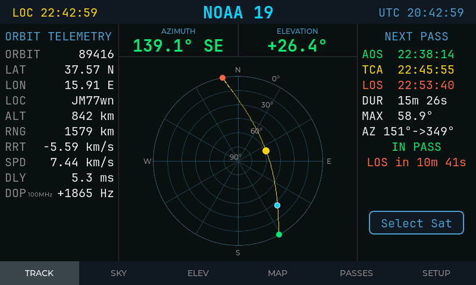
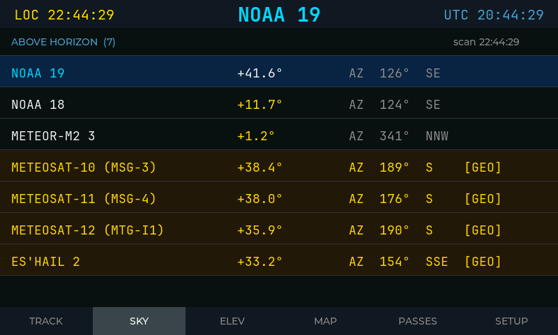
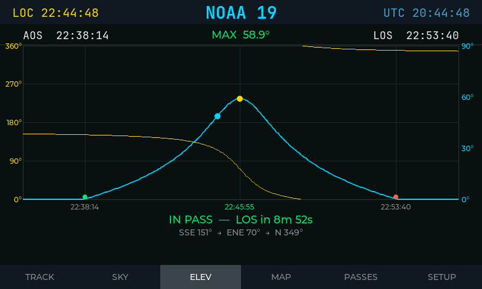
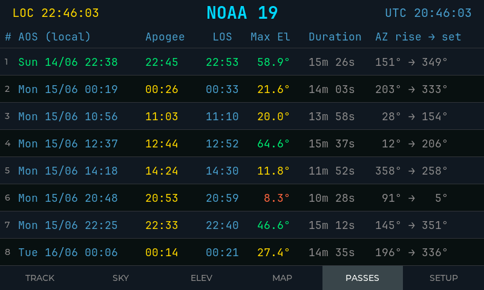
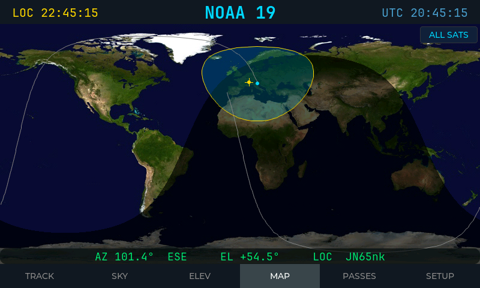
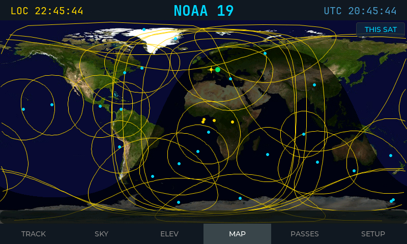
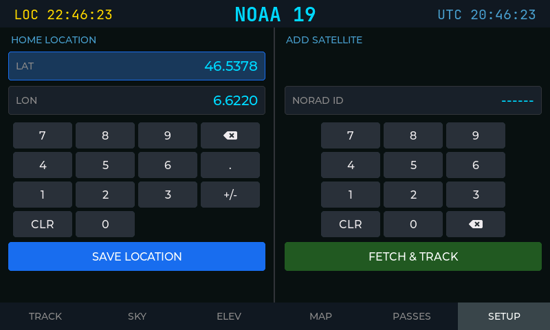
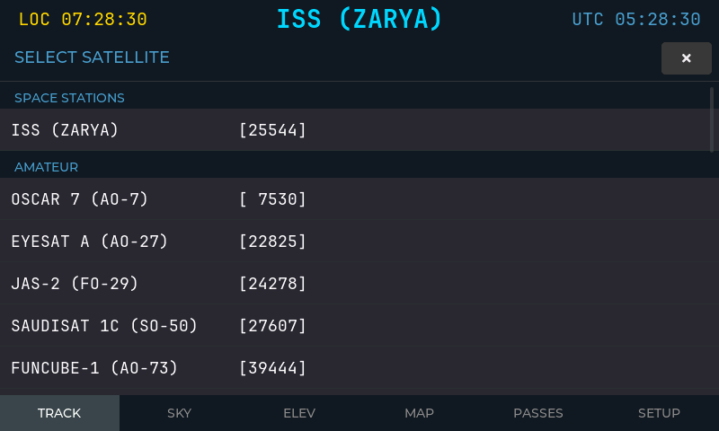

# ESP32-S3 Integrated Display Satellite Tracker

> Touch-driven satellite tracking firmware for the Waveshare ESP32-S3 integrated display boards.

This project turns an 800×480 touchscreen into a self-contained tracking console for amateur, weather, CubeSat, and geostationary satellites — handling Wi-Fi onboarding, automatic geolocation, NTP time sync, TLE download and caching, SGP4 orbit propagation, and a six-screen LVGL interface optimised for capacitive touch.

---

## ⚡ Flash in 2 Minutes

No IDE required — install directly from your browser:

**👉 [https://hb9iiu.github.io/ESP32_S3_INTEGRATED_DISPLAY_SAT_TRACKER/](https://hb9iiu.github.io/ESP32_S3_INTEGRATED_DISPLAY_SAT_TRACKER/)**

Connect the board via USB, open the link in **Chrome** or **Edge**, and click Install.

---

## Compatible Hardware

| Board | Docs |
|-------|------|
| Waveshare ESP32-S3-Touch-LCD-7 | [docs.waveshare.com](https://docs.waveshare.com/ESP32-S3-Touch-LCD-7) |
| Waveshare ESP32-S3-Touch-LCD-5 | [docs.waveshare.com](https://docs.waveshare.com/ESP32-S3-Touch-LCD-5?variant=ESP32-S3-LCD-5-touch) |

Both boards share the same ESP32-S3 SoC, 800×480 RGB parallel display, GT911 capacitive touch controller, 16 MB flash, and 8 MB OPI PSRAM.

---

## Screenshots

| TRACK | SKY |
|-------|-----|
|  |  |

| ELEV | PASSES |
|------|--------|
|  |  |

| MAP — Single Satellite | MAP — All Satellites |
|------------------------|----------------------|
|  |  |

| SETUP | SELECT |
|-------|--------|
|  |  |

---

## Features

- **Real-time telemetry** — azimuth, elevation, latitude, longitude, altitude, range, range rate, velocity, Doppler shift, and signal delay
- **Pass prediction** — next eight upcoming passes with AOS, TCA, LOS, max elevation, duration, and azimuth trend
- **Sky view** — live list of satellites currently above the horizon; tap any row to start tracking
- **Elevation profile** — time-vs-elevation curve for the active pass with AOS/TCA/LOS markers
- **World map** — satellite position, ground track, footprint, observer marker, and day/night terminator
- **Geostationary support** — fixed-orbit display mode for GEO satellites (no pass prediction)
- **On-screen Wi-Fi setup** — scans for networks, touch-keyboard credential entry, verifies connection before saving
- **On-device configuration** — observer location and ad-hoc NORAD TLE fetch without recompiling
- **Self-contained** — all libraries vendored; fresh clone builds with zero downloads

---

## Satellite Catalogue

The default catalogue in `src/myconfig.h` covers 32 ham-focused satellites across several groups:

- Space stations (ISS, Tiangong)
- Amateur radio satellites (AO-7, AO-73, AO-91, FO-29, JO-97, …)
- CubeSats (GREENCUBE, MESAT-1, TEVEL, …)
- NOAA & Meteosat weather satellites
- QO-100 (Es'hail-2) geostationary transponder

The satellite name in the header opens a grouped selector overlay; tap any entry to switch tracking targets immediately.

---

## Runtime Architecture

### Boot Sequence

1. Initialise serial, display, touch controller, and LittleFS
2. Show `/splash.jpg` if present
3. **Factory-reset window** — touch and hold 3 s to clear Wi-Fi, location, and timezone cache
4. **Wi-Fi onboarding** — if no credentials are stored, launch the on-screen Wi-Fi setup page (network scan + touch keyboard); device reboots after saving
5. Connect to Wi-Fi using cached BSSID/channel hints when available
6. Start mDNS (`hb9iiu.local` by default)
7. Fetch or load cached observer location via IP geolocation
8. Fetch or load cached UTC offset
9. Sync time via NTP
10. Refresh TLE data from Celestrak if the last fetch is older than 24 hours
11. Initialise SGP4, compute passes, start sky-scan task, build LVGL UI

### Core Modules

| Module | Responsibility |
|--------|---------------|
| `src/boot_manager.h` | Full boot sequence — Wi-Fi, geolocation, timezone, NTP, TLE refresh |
| `src/wifi_page.h` | On-screen Wi-Fi credential entry (network scan, touch keyboard, NVS save) |
| `src/nvs_config.h` | Persistent storage — Wi-Fi, AP hints, location, timezone cache, selected satellite |
| `src/tle_manager.h` | TLE fetch, parse, store, freshness checks, LittleFS file access |
| `src/sat_tracker.h` | SGP4 state, live orbital calculations, pass prediction, background sky scan |
| `src/screen_manager.h` | Header, navigation bar, screen switching, periodic UI updates |

### Screens

| Screen | Purpose |
|--------|---------|
| `TRACK` | Live telemetry, polar sky plot, next-pass summary, AZ/EL readout |
| `SKY` | Satellites above the horizon; tap to track |
| `ELEV` | Elevation-vs-time profile for the current pass |
| `MAP` | World map with position, ground track, footprint, terminator — single-sat or all-sats view |
| `PASSES` | Next eight passes or GEO summary for geostationary satellites |
| `SETUP` | Observer location entry and direct NORAD fetch-and-track |

---

## Project Layout

```
├── platformio.ini          PlatformIO environments and build flags
├── partitions.csv          Flash partition table
├── gen_font.py             TTF → LVGL font generator
├── get_version.py          Pre-build script — stamps firmware version from git tags
├── data/                   LittleFS assets (splash.jpg, worldmap.jpg)
├── Doc/Screenshots/        Screen captures (PNG)
├── include/
│   └── HB9IIUdisplayInit.h Board-specific display and touch initialisation
├── src/
│   ├── main.cpp            Application entry point
│   ├── boot_manager.h      Startup flow and network bootstrap
│   ├── wifi_page.h         On-screen Wi-Fi credential entry
│   ├── sat_tracker.h       Orbit propagation and pass prediction
│   ├── tle_manager.h       TLE download and storage
│   ├── nvs_config.h        Persistent settings
│   ├── screen_manager.h    Top-level LVGL screen orchestration
│   ├── screen_tracker.h    TRACK screen
│   ├── screen_polar.h      SKY screen
│   ├── screen_elev.h       ELEV screen
│   ├── screen_map.h        MAP screen
│   ├── screen_passes.h     PASSES screen
│   ├── screen_setup.h      SETUP screen
│   ├── screen_selector.h   Satellite selector overlay
│   ├── lv_driver.h         LVGL display flush and touch callbacks
│   ├── myconfig.h          Hostname, default satellite, catalogue definition
│   └── fonts/              Generated JetBrains Mono LVGL font sources
└── lib/                    Vendored third-party libraries
```

---

## Build and Flash

### Requirements

- PlatformIO CLI or the VS Code PlatformIO extension
- USB connection to the board

All libraries are vendored under `lib/` — no separate dependency downloads needed.

### Commands

```bash
# Build main firmware
pio run -e DISPLAY

# Flash main firmware
pio run -e DISPLAY -t upload

# Upload LittleFS assets (run after changing files in data/)
pio run -e DISPLAY -t uploadfs

# Serial monitor
pio device monitor -b 115200

# Font showcase (build / flash)
pio run -e FONT_TEST
pio run -e FONT_TEST -t upload
```

---

## First Boot

1. Power on the board
2. If no Wi-Fi credentials are stored, an on-screen keyboard appears — select your network from the scanned list, enter the password, tap **OK**
3. The device connects, verifies, saves credentials, and reboots
4. On the next boot it fetches location, syncs time, refreshes TLE data, and opens the tracker UI

Subsequent boots skip straight to the tracker if Wi-Fi and location are already cached.

> **Factory reset:** Touch and hold the screen for 3 seconds during the boot window to clear all stored credentials and location data.

---

## Configuration

Edit `src/myconfig.h` to customise:

- Wi-Fi hostname (`WIFI_HOSTNAME`)
- Default satellite on first boot (`DEFAULT_SAT_ID`)
- TLE source groups fetched from Celestrak (`TLE_GROUPS`)
- NORAD ID catalogue and grouping for the selector UI (`SAT_LIST`)

Runtime changes (no recompile needed) via the SETUP screen:

- Observer latitude and longitude
- Active tracked satellite by NORAD ID

---

## Font Generation

JetBrains Mono LVGL fonts are pre-generated in `src/fonts/`. To regenerate or add sizes:

```bash
# Install the font converter once
npm install -g lv_font_conv

# Regenerate all configured sizes
python3 gen_font.py

# Generate a custom size
python3 gen_font.py --font fonts/JetBrainsMono-Bold.ttf --sizes 20 24 28
```

---

## Notes and Limitations

- NTP sync is required for correct orbit propagation; the firmware reboots and retries if sync fails
- TLE refresh is rate-limited to once per 24 hours (last-fetch timestamp, not TLE epoch age)
- Factory reset clears credentials and location but does not erase TLE files in LittleFS
- The MAP screen requires `/worldmap.jpg` in LittleFS; the splash screen is optional
- Pass storage is capped at eight future passes; sky scan covers a fixed number of catalog entries
- Geostationary satellites use a fixed-orbit display rather than pass prediction

---

## License

This repository vendors third-party libraries under `lib/`, including LVGL, LovyanGFX, ArduinoJson, Sgp4, and QRCode. See the individual license files inside those directories for their terms.
